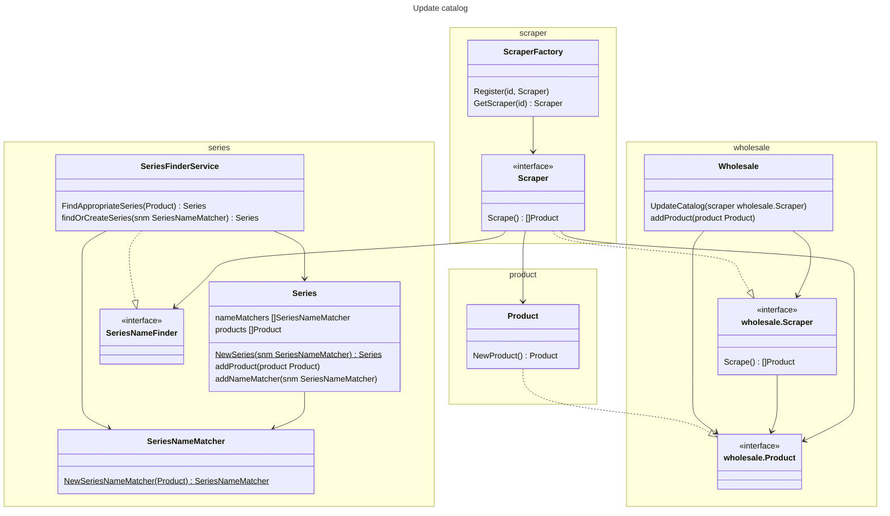

```mermaid
---
title: Update catalog
---
classDiagram
  namespace scraper {
    class ScraperFactory {
      Register(id, Scraper)
      GetScraper(id) Scraper
    }
  
    class Scraper {
      <<interface>>
      Scrape() []Product
    }
  }

  namespace product {
    class Product {
      NewProduct() Product
    }
  }

  namespace series {
    class Series {
      nameMatchers []SeriesNameMatcher
      products []Product

      NewSeries(snm SeriesNameMatcher)$ Series
      addProduct(product Product)
      addNameMatcher(snm SeriesNameMatcher)
    }
    class SeriesFinderService {
      FindAppropriateSeries(Product) Series
      findOrCreateSeries(snm SeriesNameMatcher) Series
    }

    class SeriesNameMatcher {
      NewSeriesNameMatcher(Product)$ SeriesNameMatcher
    }

    class SeriesNameFinder {
      <<interface>>
    }
  }

  namespace wholesale {
    class Wholesale {
      UpdateCatalog(scraper wholesale.Scraper)
      addProduct(product Product)
    }

    class `wholesale.Scraper` {
      <<interface>>
      Scrape() []Product
    }

    class `wholesale.Product` {
      <<interface>>
    }
  }

  ScraperFactory --> Scraper
  Scraper --> `Product`
  Scraper --> `wholesale.Product`
  `wholesale.Scraper` --> `wholesale.Product`
  Wholesale --> `wholesale.Product`
  SeriesFinderService --> Series
  Series --> `SeriesNameMatcher`
  Wholesale --> `wholesale.Scraper`
  SeriesFinderService --> SeriesNameMatcher
  Scraper --> SeriesNameFinder

  Scraper ..|> `wholesale.Scraper`
  Product ..|> `wholesale.Product`
  SeriesFinderService ..|> SeriesNameFinder
```

| namespace | in | out | \<I\> |
|---|---|---|---|
| series | 1 | 0 | 1 |
| wholesale | 2 | 0 | 1 |
| scraper | 0 | 3 | 0 |
| product | 1 | 2 | 0.33 |