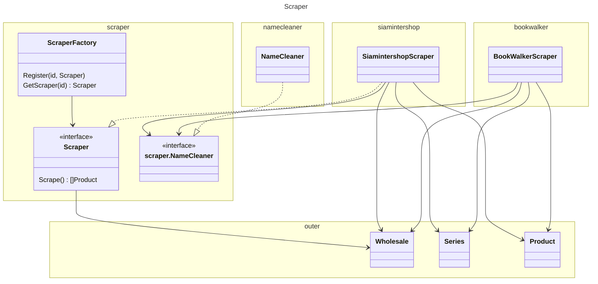

```mermaid
---
title: Scraper
---
classDiagram
  namespace outer {
    class Wholesale 
    class Series 
    class Product
  }

  namespace namecleaner {
    class NameCleaner
  }

  namespace scraper {
    class ScraperFactory {
      Register(id, Scraper)
      GetScraper(id) Scraper
    }
  
    class Scraper {
      <<interface>>
      Scrape() []Product
    }

    class `scraper.NameCleaner` {
      <<interface>>
    }
  }

  namespace siamintershop {
    class SiamintershopScraper {
    }
  }

  namespace bookwalker {
    class BookWalkerScraper {
    }
  }
  

  Scraper --> Wholesale
  SiamintershopScraper --> Wholesale
  SiamintershopScraper --> Series
  SiamintershopScraper --> Product
  BookWalkerScraper --> Wholesale
  BookWalkerScraper --> Series
  BookWalkerScraper --> Product
  
  ScraperFactory --> Scraper
  SiamintershopScraper --> `scraper.NameCleaner`
  BookWalkerScraper --> `scraper.NameCleaner`

  SiamintershopScraper ..|> Scraper
  NameCleaner ..|> `scraper.NameCleaner`
```